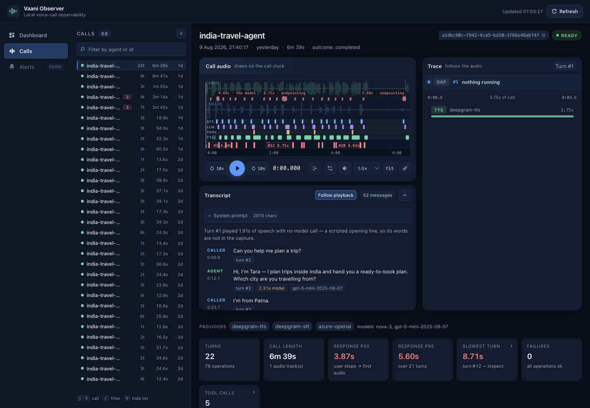
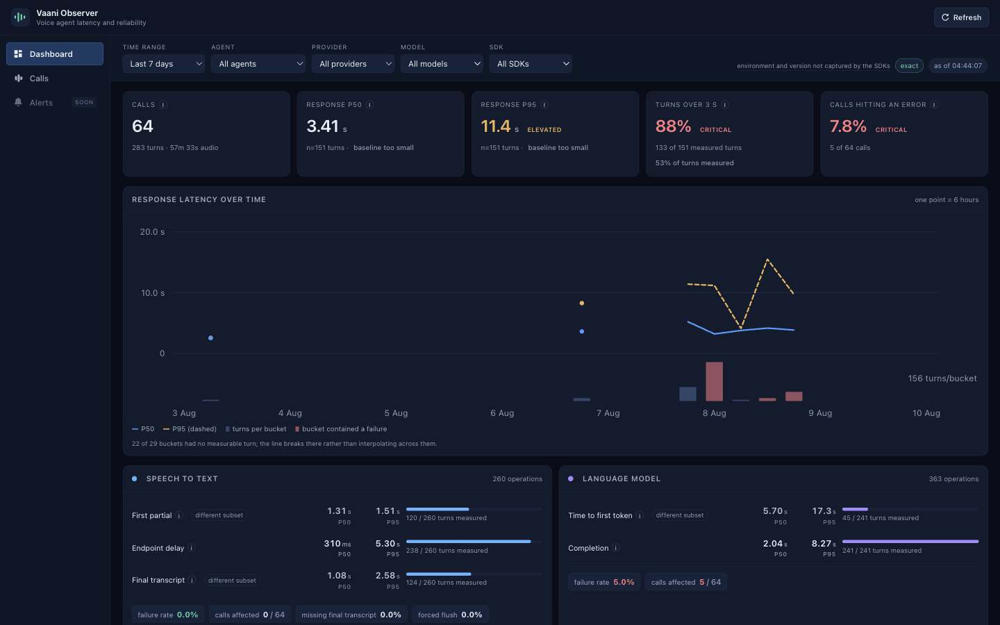

# Vaani Observer Dashboard

> Local-first observability and STT evaluation for production voice agents.

Vaani Observer captures what happened during a live voice call, then gives your
team a post-call workspace to inspect audio, transcripts, provider spans, turn
timing, and estimated speech-to-text disagreement. The live media path never
waits for this service: SDKs write a portable session package locally and upload
only after the call finishes.



## Why Vaani Observer

When a voice conversation feels slow or inaccurate, application logs are rarely
enough to explain why. Vaani Observer puts the audio timeline, streamed STT,
LLM, TTS, tool calls, transcript, and call-level latency measures in one review
surface. It helps answer:

- Where did a production transcript disagree with a challenger model, and is it
  worth listening to the audio?
- Did STT detect and finalise caller turns quickly enough for a natural live
  conversation?
- Which provider, model, operation, or turn was responsible for a slow or
  failed response?



## Architecture at a glance

```text
Voice agent
  │  Vaani Observer SDK (Node.js or Python)
  │  writes after capture, never on the live network path
  ▼
Portable session package
  manifest.json · events.jsonl · call.audio
  │
  ▼
This dashboard
  ingest · SQLite/local objects · review console · STT evaluation
```

FastAPI ingestion service, browser console and **STT evaluation engine** for the
Vaani Observer voice-call observability platform.

It ingests the session packages (`manifest.json`, `events.jsonl`, `call.audio`)
uploaded by either capture SDK — the
[Node.js SDK](https://github.com/shubhamofbce/vaanieval-observer-nodejs-sdk) or
the [Python SDK](https://github.com/shubhamofbce/vaanieval-observer-python-sdk),
which emit a byte-compatible format — persists them locally, and answers two
questions about a completed call:

1. **Where did production STT disagree with a stronger challenger transcript,
   and should I listen to the audio?**
2. **Did the production model detect and finalize caller turns quickly and
   reliably enough for a live agent?**

It is normally checked out as `dashboard/` next to `nodejs-sdk/` and
`python-sdk/` in a `vaanieval-observer` working directory.

## Requirements

- Python 3.11+

## Setup

```bash
python -m venv .venv
source .venv/bin/activate
pip install -r requirements.txt
pip install -r requirements-dev.txt   # for tests
```

## Run

```bash
uvicorn app.main:app --reload --port 8000
```

The console is served at `http://localhost:8000/` and the per-call STT
evaluation workspace at `/stt-evaluation?session=<id>`. Start at
`/onboarding`, which mints an API key and walks an SDK integration end to end.

Ingest is **unauthenticated by default** and there is no tenant isolation: this
is a development tool, and every agent already pointed at a local instance
sends the documented placeholder key `local-dev`. Keys minted on the onboarding
page are always *recorded* when presented — that is what verifies the setup —
and setting `VAANI_REQUIRE_API_KEY=1` turns that record into a gate, rejecting
`POST /v1/sessions` and `/complete` with `401` unless a live key is sent as
`Authorization: Bearer <key>`. Object `PUT`s stay open under enforcement
because both SDKs strip the header from them, modelling the upload URL as a
pre-signed object-store URL rather than an authenticated endpoint.

Under enforcement, minting and revoking keys need a live key too — otherwise
the gate costs an attacker exactly one unauthenticated `POST /v1/api-keys`.
The one exception is bootstrap: a request from the loopback interface may mint
the **first** key when no active key exists, so switching enforcement on before
minting a key cannot lock you out. A request carrying any forwarding header
(`X-Forwarded-For`, `Forwarded`, `X-Real-IP`, `X-Forwarded-Host`) is never
treated as local, because behind a reverse proxy every visitor arrives as
`127.0.0.1`. If you terminate TLS on a proxy that neither strips nor annotates
those headers, mint the first key on the host itself. Key *listing* stays open,
like every other read endpoint on this console — it returns prefixes and usage,
never a secret.

## What it does

**Onboarding (`/onboarding`)** — the first surface a new developer sees: mint an
API key, install the Python or Node.js SDK, instrument an agent, and confirm
the result. Four steps, and three of them are decided entirely by rows that
ingest wrote — an active key, a manifest carrying an SDK version, a session,
and a session with at least one operation on it. Nothing is ticked because a
button was clicked.

The last two steps are deliberately not one step. The most common way a
correct-looking integration fails is that the call uploads perfectly and
captures nothing, because no configured `endpoints` rule matched the URLs the
agent calls. Collapsed into a single "first call received ✓" the developer
declares victory over an empty dashboard; kept apart, the page states that the
call arrived, that no operation was recorded, and which config line explains
both. Installing a package is the one step this service genuinely cannot
observe until data flows, so it is the only one a developer may mark
themselves — rendered as their own note rather than borrowing the tick
everything else has to earn.

| Module | Responsibility |
| --- | --- |
| `app/keys.py` | API keys: mint, list, revoke, verify, record use. Only a SHA-256 digest is stored, so the plaintext exists exactly once — in the creation response. |
| `app/onboarding.py` | Derives each setup step from the row that proves it, with bounded, index-served queries so the setup page does not become the most expensive endpoint in the product. |

**Console** — a calls rail, a trace view, an all-spans table, an audio player
with server-rendered waveform peaks, and a transcript panel that follows
playback. Audio is stored once as the SDK's raw PCM; the console requests an
on-demand WAV wrapper for browser playback rather than storing a second copy.
The wrapper streams and honours HTTP `Range`, which Safari requires before it
will play any media response.

**STT evaluation (Stage 1)** — a manual, post-call comparison of one recorded
call against one challenger model:

| Module | Responsibility |
| --- | --- |
| `app/evaluation.py` | Pure deterministic scoring: normalization, word alignment, estimated WER, S/D/I counts, word-to-turn mapping. No clock, no provider, no global state — every displayed value can be recomputed from the stored call. |
| `app/latency.py` | Turn detection and latency: first partial, endpoint delay, final-from-last-word, endpoint position error, barge-in, forced flushes, splits/merges/missing finals. |
| `app/challenger.py` | Batch and streaming challenger runs against the recorded caller track. |
| `app/risk.py` | LLM judge that classifies whether a transcript disagreement could change the conversation. Cached by content fingerprint. |
| `app/pricing.py` | Per-minute list pricing with provenance, batch→streaming substitution for switch decisions, monthly savings estimate. |
| `app/payload.py` | Assembles the single evaluation payload the UI reads, including the same-agent cohort. |

Three interpretation rules are enforced throughout:

- The challenger is a **pseudo-reference, not ground truth**. The score is
  labelled *estimated WER* / *model disagreement*, never accuracy.
- **Unavailable is shown as `—` with a reason** — never `0`, and never inferred
  from an operation's start/end time or a batch HTTP round trip.
- **A session-long STT websocket is a connection span, not an utterance**, and
  is never scored as a turn.

## API

| Method | Path | Description |
| --- | --- | --- |
| `GET` | `/health` | Health check |
| `GET` | `/v1/onboarding/status` | Per-step setup state, each derived from a row this instance holds |
| `GET`/`POST` | `/v1/api-keys` | List keys (digests only) / mint one; the plaintext token is returned exactly once. `POST` needs a live key under enforcement |
| `DELETE` | `/v1/api-keys/{key_id}` | Revoke a key. A tombstone, not a delete — "which key was live when" survives. Needs a live key under enforcement |
| `POST` | `/v1/sessions` | Create a session from a manifest |
| `PUT` | `/v1/uploads/{session_id}/{object_name}` | Upload `events.jsonl`, `call.audio`, `caller.audio` or `agent.audio` |
| `POST` | `/v1/sessions/{session_id}/complete` | Mark a session complete with byte sizes and digests |
| `GET` | `/v1/sessions` | List sessions |
| `GET` | `/v1/sessions/{session_id}` | Session detail |
| `GET` | `/v1/sessions/{session_id}/audio/{track}` | Stream an audio track; `?preview=wav` wraps raw PCM, `&from_ms=&to_ms=` cuts a clip |
| `GET` | `/v1/sessions/{session_id}/audio/{track}/peaks` | Waveform envelope for the player, one peak per pixel column |
| `GET` | `/v1/sessions/{session_id}/stt-evaluation` | Every measured production and challenger value for the call |
| `GET`/`POST` | `/v1/sessions/{session_id}/challenger-evaluation` | Poll / queue a challenger run (executed off the request thread, status tracked in SQLite) |
| `GET`/`PUT` | `/v1/pricing` | Read or override the cost model |

## Configuration

| Variable | Purpose |
| --- | --- |
| `VAANI_DATA_DIR` | Runtime data directory (default `./data`) |
| `VAANI_REQUIRE_API_KEY` | `1` rejects ingest that does not present a live key. Off by default so existing local agents keep working |
| `ELEVENLABS_API_KEY` | Challenger transcription; required to run an evaluation |
| `OPENAI_API_KEY` | Semantic risk judge |
| `STT_EVAL_JUDGE_MODEL` | Judge model (default `gpt-4o-mini`) |
| `VAANI_ENV_FILE` | `os.pathsep`-separated dotenv paths to read keys from when they are not exported. Falls back to `./.env`, which is gitignored. |

Never commit provider keys. `.env` and `data/` are both gitignored.

## Tests

```bash
pytest
```

Tests run against a temporary data directory and SQLite file per test, so they
never touch `data/`.

`scripts/validate-latency.py` is a deliberate **second implementation**: it
re-derives every published latency value straight from `events.jsonl` using its
own arithmetic and asserts the payload agrees. It is wired into the suite, so a
change that reintroduces a fabricated measurement fails the build. It needs
recorded calls in `data/`, so that test skips on a clean checkout.

## Storage

Runtime state lives in `data/` (SQLite database plus uploaded objects). That
directory is gitignored and created on first run — recorded calls contain
customer audio and transcripts and are never committed.

## Scaling implications

Deliberate limits, stated so they are not mistaken for production readiness:

- **SQLite plus local files, single-process uploads capped at 128 MiB.** Fine for
  one machine and a developer loop; production needs object storage, Postgres
  and async audio processing.
- **No authentication and no multi-tenant isolation.** Do not expose this.
- **Audio dominates storage.** Two raw 16-bit PCM tracks are ~64 KB/s of call at
  16 kHz. Production needs retention policies and, realistically, Opus.
- **Challenger jobs run on a two-worker in-process thread pool**, bounded by that
  pool and by provider rate limits. A real deployment wants a separate queue.
- **Evaluation costs money per run** — challenger transcription and the judge
  both bill per call. Cost figures are published list prices with provenance,
  not invoices.
- **WER here is a disagreement score, not accuracy**, until a human-reviewed
  reference transcript exists.

## License

MIT
